# Taller 2: Despliegue de aplicaciones en Kubernetes (kubeadm)

| | |
| --- | --- |
| **Asignatura** | Infraestructura III |
| **Tema** | Orquestación de contenedores con Kubernetes |
| **Modalidad** | Individual |
| **Entregable** | Opción B: repositorio en GitHub con README |
| **Autor** | Juan José De La Pava ([@JuanJDlp](https://github.com/JuanJDlp)) |
| **App desplegada** | [mariocr73/K8S-apps](https://github.com/mariocr73/K8S-apps) (commit `c9480eb`), adaptada (ver [sección 3](#3-cambios-respecto-al-repositorio-original)) |

Este informe documenta el despliegue, la exposición, el escalamiento y la prueba de
auto-recuperación (self-healing) de una aplicación Flask sobre el clúster kubeadm
construido en el taller anterior. Cada captura va precedida del comando ejecutado y
seguida de su interpretación.

## Índice

1. [Resultados esperados](#1-resultados-esperados)
2. [Entorno: clúster kubeadm en AWS](#2-entorno-clúster-kubeadm-en-aws)
3. [Cambios respecto al repositorio original](#3-cambios-respecto-al-repositorio-original)
4. [Preparación adicional: registro privado ECR](#4-preparación-adicional-registro-privado-ecr)
5. [Fase 1: Preparación](#5-fase-1-preparación)
6. [Fase 2: Análisis del repositorio](#6-fase-2-análisis-del-repositorio)
7. [Fase 3: Despliegue](#7-fase-3-despliegue)
8. [Fase 4: Exposición de la aplicación](#8-fase-4-exposición-de-la-aplicación)
9. [Fase 5: Escalamiento](#9-fase-5-escalamiento)
10. [Fase 6: Prueba de resiliencia](#10-fase-6-prueba-de-resiliencia)
11. [Retos adicionales](#11-retos-adicionales)
12. [Análisis técnico](#12-análisis-técnico)
13. [Resumen de comandos](#13-resumen-de-comandos)
14. [Conclusiones](#14-conclusiones)

---

## 1. Resultados esperados

| Resultado (guía, sección 7) | Evidencia |
| --- | --- |
| ✅ Clúster funcional y operativo | `kubectl get nodes`: `master` y `worker` en `Ready`, v1.37.1 ([Fase 1](#5-fase-1-preparación)) |
| ✅ Aplicación desplegada correctamente | Pods `Running` con la imagen descargada de ECR ([Fase 3](#7-fase-3-despliegue)) |
| ✅ Servicio accesible | `curl http://worker.k8s.lab:30001` responde `¡Hola Mundo desde Kubernetes!` ([Fase 4](#8-fase-4-exposición-de-la-aplicación)) |
| ✅ Escalamiento exitoso (mínimo 3 pods) | El Deployment pasa de 2 a 3 réplicas ([Fase 5](#9-fase-5-escalamiento)) |
| ✅ Evidencia clara de self-healing | Se borra un pod y aparece uno nuevo a los 2 s ([Fase 6](#10-fase-6-prueba-de-resiliencia)) |
| ✅ Los 4 retos opcionales | Cambio de imagen (v1 → v2), variables de entorno, Service NodePort y logs ([sección 11](#11-retos-adicionales)) |

Capturas exigidas en el entregable (guía, sección 8):

| Captura | Dónde |
| --- | --- |
| `kubectl get nodes` | [Imagen 6](#5-fase-1-preparación) |
| `kubectl get pods` | [Imágenes 6, 9b y 12](#7-fase-3-despliegue) |
| `kubectl get services` | [Imagen 10](#8-fase-4-exposición-de-la-aplicación) |
| Aplicación funcionando | [Imágenes 7 y 13](#8-fase-4-exposición-de-la-aplicación) |

---

## 2. Entorno: clúster kubeadm en AWS

La guía pide un clúster **kubeadm sobre VirtualBox**. En su lugar se usó el clúster
kubeadm del taller anterior, desplegado sobre **instancias EC2 en AWS**. Lo que evalúa
el taller no cambia:

- **Es kubeadm puro, no EKS.** El plano de control (API server, etcd, scheduler,
  controller-manager), containerd, el CNI (Flannel) y el firewall se instalan con los
  mismos pasos que en VirtualBox. La única diferencia es que están automatizados con
  Terraform y Ansible.
- **Se mantiene la misma topología de red** del taller con VirtualBox:

| VirtualBox (guía) | Este clúster (AWS) |
| --- | --- |
| VM con red NAT/Bridge (acceso de administración) | `bastion` en la subnet pública, con `kubectl` |
| VMs en red interna | `master` (10.0.2.10) y `worker` (10.0.2.20) en la subnet privada, sin IP pública |
| `/etc/hosts` o DNS local | Zona privada de Route 53 `k8s.lab` (`master.k8s.lab`, `worker.k8s.lab`) |

| Componente | Versión / elección |
| --- | --- |
| Kubernetes | kubeadm / kubelet / kubectl **v1.37.1** |
| Runtime | containerd 2.x (cgroup driver `systemd`) |
| CNI | Flannel (VXLAN), red de Pods `10.244.0.0/16` |
| SO | Rocky Linux 9 |

El estado del repositorio al terminar el taller 1 quedó marcado con el tag
`taller-1-cluster`. Así este taller arranca desde un punto de partida identificable:

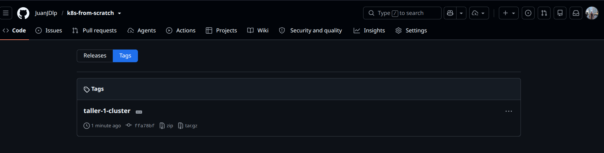

*Imagen 1. Tag `taller-1-cluster` publicado en GitHub, sobre el commit `ffa78bf`.*

El detalle de cómo se construye el clúster está en el [README principal](../README.md)
y en [ansible/README.md](../ansible/README.md). Todo el entorno se levanta con un solo
comando: `make up`.

---

## 3. Cambios respecto al repositorio original

> **Importante:** el repositorio [mariocr73/K8S-apps](https://github.com/mariocr73/K8S-apps)
> no se puede desplegar tal como viene. Sus manifiestos tienen *placeholders*
> (`<nombre_de_usuario_en_docker_hub>`, `<valor_..._en_base64>`) y la imagen no existe en
> ningún registro. Se clonó dentro de esta carpeta (`taller-2-apps/K8S-apps/`) y se
> modificó como se detalla abajo.

| Archivo | Original | Modificado | Motivo |
| --- | --- | --- | --- |
| `K8S_files/webapp-deployment.yaml` | `image: <usuario_docker_hub>/<repo>:<tag>` + `imagePullSecrets: regcred` | Imagen en ECR privado (`…/k8s-from-scratch/webapp:v2`), sin `imagePullSecrets`, con `envFrom` (ConfigMap + Secret) y `resources` | La imagen tiene que existir en un registro real. La autenticación la hace el nodo ([sección 4](#4-preparación-adicional-registro-privado-ecr)). Las variables de entorno son un reto. Los `requests` le dicen al scheduler cuánto pesa cada pod. |
| `K8S_files/webapp-replicaset.yaml` | Mismos *placeholders* | Imagen `…/webapp:v1` en ECR, sin `imagePullSecrets` | Se aplica a propósito para analizar qué pasa cuando un ReplicaSet suelto convive con un Deployment ([sección 12](#121-replicaset-suelto-y-deployment-con-el-mismo-label)). |
| `K8S_files/webapp-dbsecret.yaml` | `data:` con `<valor_..._en_base64>` | `stringData:` con valores de ejemplo | Los *placeholders* no son base64 válido y hacían fallar `kubectl apply -f .`. `stringData` deja que Kubernetes haga la codificación. |
| `K8S_files/webapp-dhsecret.yaml` | Secret `regcred` de tipo `Opaque` | **Eliminado** | Con ECR no hace falta. Además estaba mal definido: `imagePullSecrets` necesita el tipo `kubernetes.io/dockerconfigjson`, no `Opaque`. |
| `app.py` | Responde `¡Hola Mundo desde Kubernetes!` | v2: agrega la versión y el nombre del pod que atiende (`socket.gethostname()`) | Reto "cambiar la imagen": permite ver qué pod responde cada petición. |
| `Dockerfile` | `FROM python:3.9-slim` | `FROM python:3.12-slim` (v2) | Python 3.9 ya no tiene soporte, y el escaneo de ECR reporta sus vulnerabilidades. |
| `K8S_files/webapp-service.yaml` | NodePort 30001 → 5000 | Sin cambios | El repositorio original ya define un Service **NodePort** ([sección 11.3](#113-service-tipo-nodeport)). |
| `K8S_files/webapp-configmap.yaml` | `APP_ENV: production` | Sin cambios | En el original no se usaba; ahora el Deployment lo consume con `envFrom`. |

> El `.git` del repositorio original se eliminó para que sus archivos queden versionados
> en este repositorio. Si se dejara, git lo trataría como un repositorio anidado y no
> subiría su contenido.

---

## 4. Preparación adicional: registro privado ECR

El README del repositorio original sube la imagen a Docker Hub. Aquí se usó **Amazon ECR**
(registro privado de AWS), configurado de forma que **los nodos descargan imágenes sin
credenciales guardadas en el clúster**.

### 4.1 Terraform: repositorio y permisos

`terraform/infra/ecr.tf` crea el repositorio `k8s-from-scratch/webapp` (escaneo al subir,
retención de las últimas 10 imágenes). Al rol IAM del master y del worker se le agrega la
política administrada `AmazonEC2ContainerRegistryPullOnly`, que **solo permite descargar**.

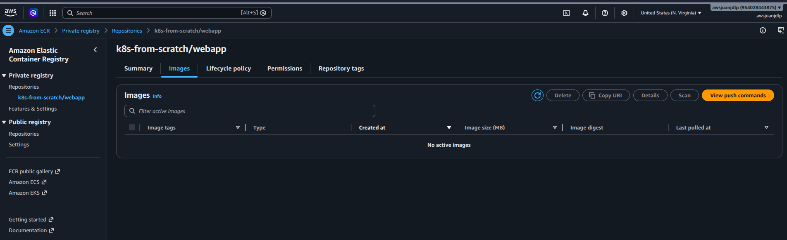

*Imagen 2. Repositorio `k8s-from-scratch/webapp` creado por Terraform, todavía vacío.*

### 4.2 Ansible: `ecr-credential-provider` en el kubelet

Quien descarga las imágenes es el **kubelet** (a través de containerd), no el pod: la
descarga ocurre antes de que exista el contenedor. Por eso la autenticación se resuelve
en el nodo con el mecanismo de *kubelet image credential providers* (GA desde Kubernetes
1.26). El rol de Ansible `ecr_credential_provider`:

1. Instala el binario oficial `ecr-credential-provider` v1.37.0 (de
   `kubernetes/cloud-provider-aws`), verificando su checksum.
2. Escribe `/etc/kubernetes/credential-provider-config.yaml`, que le indica al kubelet
   que use el plugin para las imágenes `*.dkr.ecr.*.amazonaws.com`.
3. Agrega `--image-credential-provider-config` y `--image-credential-provider-bin-dir`
   al kubelet en `/etc/sysconfig/kubelet`.

Cuando el kubelet necesita una imagen de ECR, ejecuta el plugin. El plugin obtiene
credenciales del rol IAM del nodo (IMDSv2), llama a `ecr:GetAuthorizationToken` y
devuelve un token válido por 12 h, que el kubelet guarda en caché.

**Por qué no usar `imagePullSecrets`:** el token de ECR vence a las 12 h. Un Secret
`dockerconfigjson` habría que regenerarlo periódicamente (con un CronJob o un
controlador), y además quedaría almacenado en la API de Kubernetes. Con el credential
provider no hay nada guardado que pueda vencer. Es el mismo mecanismo que usa EKS en sus
nodos.

### 4.3 Construir y subir la imagen

```bash
make image   # aws ecr get-login-password | docker login --password-stdin + docker build + docker push
```

`--password-stdin` hace que el token pase por un pipe en lugar de ir como argumento. Así
no queda en el historial del shell ni en la lista de procesos (`ps`). La imagen se
construye con `--platform linux/amd64` porque los nodos son x86_64.

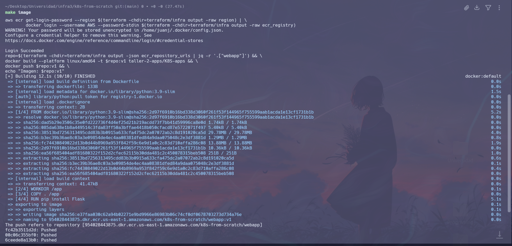

*Imagen 3. `make image`: login en ECR, build de la imagen y push de las capas al repositorio.*

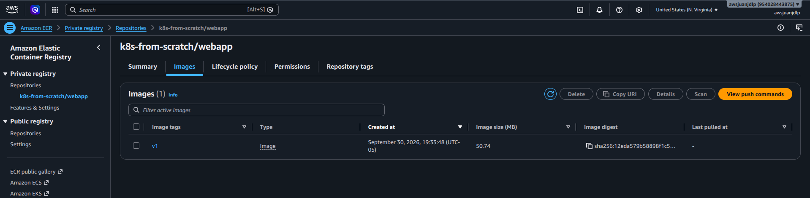

*Imagen 4. La imagen `v1` (50.74 MB) disponible en ECR.*

---

## 5. Fase 1: Preparación

La guía indica `git clone https://github.com/mariocr73/K8S-apps.git`. El repositorio se
clonó dentro de este proyecto (`taller-2-apps/K8S-apps/`) y se adaptó ([sección 3](#3-cambios-respecto-al-repositorio-original)).
Como `kubectl` está en el bastión, los manifiestos se copian allí:

```bash
scp -r taller-2-apps/K8S-apps/K8S_files bastion:
```

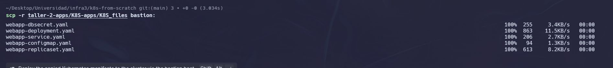

*Imagen 5. Manifiestos copiados al bastión.*

Validación del clúster:

```bash
ssh bastion
kubectl get nodes
```

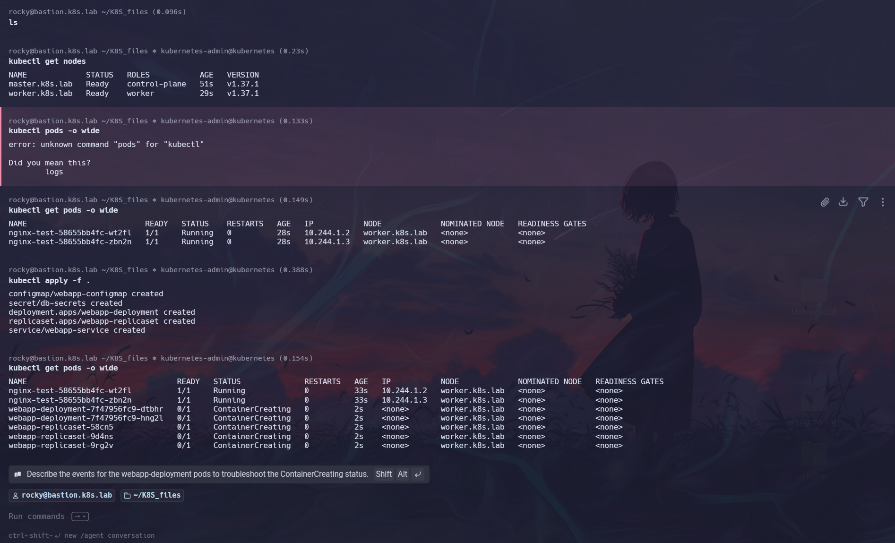

*Imagen 6. `kubectl get nodes`: los dos nodos están `Ready` con v1.37.1. El master tiene
el rol `control-plane` y el worker el rol `worker`.*

**Resultado esperado cumplido:** todos los nodos están en estado `Ready`.

> Los pods `nginx-test-*` que aparecen en las capturas son del *smoke test* que Ansible
> ejecuta al final de `make up` (`ansible/playbooks/validate.yml`) para validar el
> clúster. No forman parte de este taller.

---

## 6. Fase 2: Análisis del repositorio

### 6.1 Archivos YAML y clasificación de recursos

| Archivo | Recurso (`kind`) | Clasificación | Función |
| --- | --- | --- | --- |
| `webapp-deployment.yaml` | `Deployment` (`apps/v1`) | **Deployment** | Mantiene N réplicas del pod `app: hola-mundo`. Crea y gestiona un ReplicaSet por cada versión del template, lo que permite rolling updates y rollback. |
| `webapp-service.yaml` | `Service` (`v1`), tipo `NodePort` | **Service** | IP virtual estable (ClusterIP) que balancea hacia los pods con `app: hola-mundo`. Expone `80 → 5000` y abre el puerto `30001` en cada nodo. |
| `webapp-replicaset.yaml` | `ReplicaSet` (`apps/v1`) | **Otros** | Mantiene 3 réplicas, pero sin historial de versiones ni rolling updates. Normalmente no se crea a mano: lo crea el Deployment. |
| `webapp-configmap.yaml` | `ConfigMap` (`v1`) | **Otros** | Configuración no sensible (`APP_ENV=production`). |
| `webapp-dbsecret.yaml` | `Secret` (`v1`), tipo `Opaque` | **Otros** | Datos sensibles (usuario y clave de BD). |
| `webapp-dhsecret.yaml` | `Secret` (`v1`), tipo `Opaque` | **Otros** (eliminado) | Credenciales de Docker Hub para `imagePullSecrets`. No se usa con ECR ([sección 3](#3-cambios-respecto-al-repositorio-original)). |

Ningún manifiesto define `namespace`, así que todo se crea en `default`.

### 6.2 Pregunta obligatoria

> **¿Por qué en Kubernetes se recomienda usar Deployment en lugar de crear Pods directamente?**

Un Pod creado directamente es **efímero y nadie lo vigila**. Si se borra, si su nodo
falla o si lo desaloja la falta de recursos, desaparece y Kubernetes no lo recrea. El
kubelet reinicia los contenedores que fallan *dentro* de un pod existente, pero no recrea
un pod que ya no existe.

Un Deployment es un recurso **declarativo**: se le describe el estado deseado (qué
imagen, cuántas réplicas) y un controlador del `kube-controller-manager` trabaja
continuamente para que el estado real coincida (*reconciliation loop*). Eso aporta:

| Capacidad | Pod suelto | Deployment | Evidencia en este informe |
| --- | --- | --- | --- |
| **Self-healing**: recrear pods borrados o caídos | ❌ | ✅ | [Fase 6](#10-fase-6-prueba-de-resiliencia): un pod borrado se recrea en 2 s |
| **Escalamiento**: cambiar el número de réplicas con un comando | ❌ | ✅ | [Fase 5](#9-fase-5-escalamiento): `kubectl scale --replicas=3` |
| **Rolling update**: cambiar la imagen sin cortar el servicio | ❌ (hay que borrar y recrear) | ✅ | [Reto 11.1](#111-cambiar-la-imagen-del-deployment): v1 → v2 pod por pod |
| **Historial y rollback** | ❌ | ✅ (`kubectl rollout undo`) | [Reto 11.1](#111-cambiar-la-imagen-del-deployment): `rollout history` con 2 revisiones |

Tampoco basta con un ReplicaSet suelto. Recrea pods, pero **no actualiza los existentes
cuando cambia la imagen**. En este taller se comprobó: después del rollout a v2, los pods
del ReplicaSet siguieron respondiendo con v1 ([sección 12.1](#121-replicaset-suelto-y-deployment-con-el-mismo-label)).

---

## 7. Fase 3: Despliegue

```bash
cd K8S_files
kubectl apply -f .
kubectl get pods -o wide
```

En la Imagen 6 (más arriba), `kubectl apply -f .` crea los 5 objetos (ConfigMap, Secret,
Deployment, ReplicaSet y Service), y `kubectl get pods -o wide` muestra los 5 pods de la
app en `ContainerCreating` sobre `worker.k8s.lab`. Son 2 del Deployment
(`webapp-deployment-7f47956fc9-*`) y 3 del ReplicaSet (`webapp-replicaset-*`). El
`kubectl pods` previo es un error de tipeo (faltó `get`).

Para comprobar que la imagen se descargó desde el ECR privado **sin `imagePullSecrets`**:

```bash
kubectl describe pod webapp-deployment-7f47956fc9-dtbhr
```

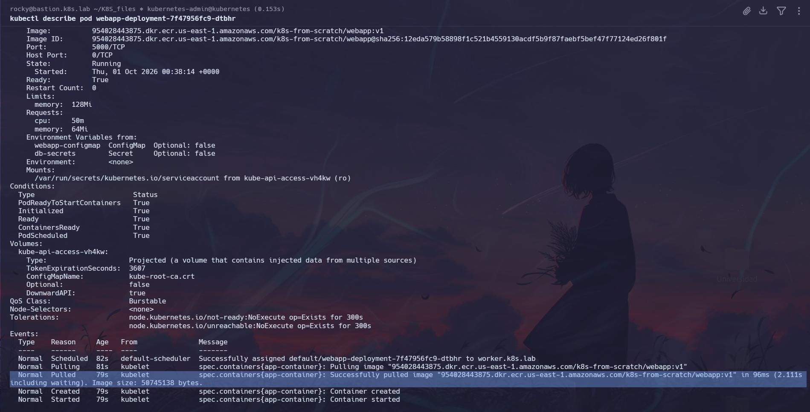

*Imagen 8. Los eventos del pod muestran `Successfully pulled image
"954028443875.dkr.ecr.us-east-1.amazonaws.com/k8s-from-scratch/webapp:v1"`. El kubelet se
autenticó con el rol IAM del nodo a través del `ecr-credential-provider`. También se
ven las variables cargadas desde `webapp-configmap` y `db-secrets`, los `requests` y
`limits`, y la QoS `Burstable`.*

La secuencia de eventos muestra quién hace cada paso:

1. `default-scheduler` → **Scheduled**: elige el nodo `worker.k8s.lab`.
2. `kubelet` → **Pulling / Pulled**: descarga la imagen de ECR.
3. `kubelet` → **Created / Started**: containerd crea y arranca el contenedor.

Verificación de los recursos:

```bash
kubectl get pods
kubectl get deployments
kubectl get services
```

El estado de pods y Services se ve en las Imágenes 9b y 10. El Deployment y sus
ReplicaSets se ven con `kubectl get rs` en la Imagen 12.

---

## 8. Fase 4: Exposición de la aplicación

```bash
kubectl get services
kubectl describe svc webapp-service
```

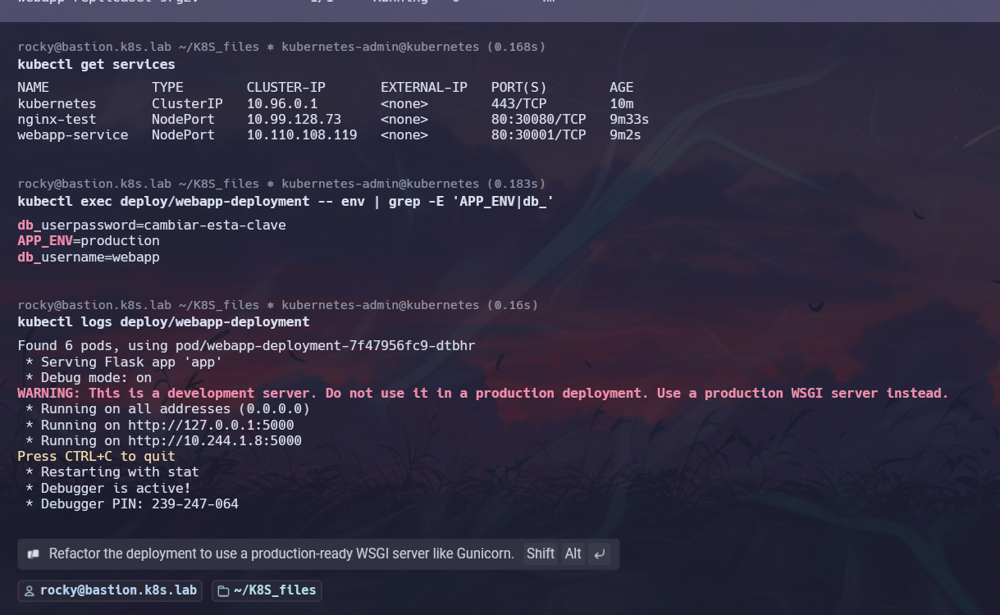

*Imagen 10. `kubectl get services`: `webapp-service` es de tipo **NodePort** (`80:30001/TCP`).
`nginx-test` es el NodePort del smoke test y `kubernetes` es el Service del API server. La
misma captura incluye los retos de variables de entorno y logs ([sección 11](#11-retos-adicionales)).*

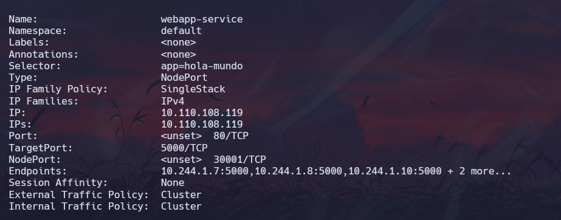

*Imagen 9a. `kubectl describe svc webapp-service`: selector `app=hola-mundo`, ClusterIP
`10.110.108.119`, `Port 80 → TargetPort 5000`, `NodePort 30001` y 5 endpoints
(`10.244.1.7:5000, 10.244.1.8:5000, 10.244.1.10:5000 + 2 more`).*

**Interpretación:**

- **ClusterIP** `10.110.108.119:80` es la IP virtual estable del Service dentro del
  clúster. kube-proxy la traduce, con reglas de iptables, a la IP de algún pod en el
  puerto 5000.
- **NodePort** `30001`: kube-proxy abre ese puerto en **todos** los nodos, así que
  `http://<cualquier-nodo>:30001` llega al Service.
- **Endpoints**: el Service no apunta a un Deployment, sino a todos los pods que cumplen
  el selector `app=hola-mundo`. Por eso aparecen 5: 2 del Deployment y 3 del ReplicaSet.

Como el Service ya es NodePort, **no hizo falta `kubectl port-forward`** (la guía lo pide
solo "si es necesario"). El puerto NodePort está permitido desde el bastión por el
security group del worker y por firewalld. Se probó desde el bastión:

```bash
curl http://worker.k8s.lab:30001
```

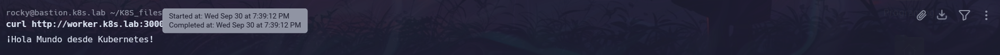

*Imagen 7. La aplicación responde `¡Hola Mundo desde Kubernetes!` a través del NodePort.*

**Resultado esperado cumplido:** el servicio es accesible.

---

## 9. Fase 5: Escalamiento

```bash
kubectl scale deployment webapp-deployment --replicas=3
kubectl get pods
```

El Deployment pasó de las 2 réplicas declaradas en el YAML a **3 réplicas**. En la primera
parte de la Imagen 9b ahora hay **3 pods** `webapp-deployment-7f47956fc9-*`: `dtbhr` y
`hng2l` (3m37s) más `njlfp` (2s), que es el que creó el escalamiento.

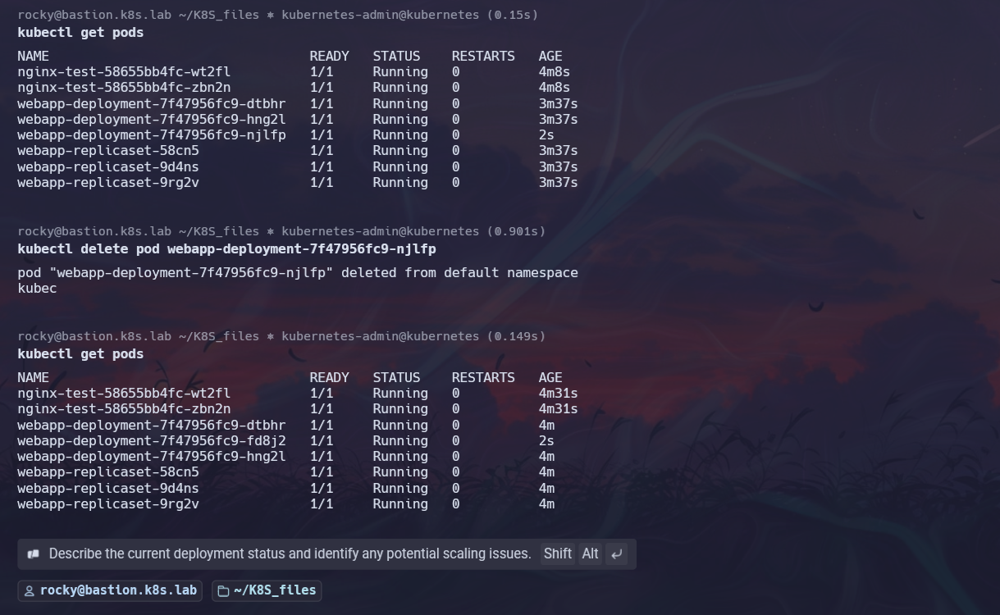

*Imagen 9b. Tras escalar, el Deployment tiene 3 pods `Running`. El nuevo (`njlfp`) tiene
2 s de edad.*

La Imagen 12 lo confirma: durante el rollout, el Deployment reporta
`"1 out of 3 new replicas have been updated"`, y `kubectl get rs` muestra
`DESIRED 3 / CURRENT 3 / READY 3` para el ReplicaSet del Deployment.

**Qué pasa internamente:** `kubectl scale` solo cambia el campo `spec.replicas` del
Deployment. El controlador de Deployments propaga el valor a su ReplicaSet. El
controlador de ReplicaSets ve 2 pods donde se desean 3 y crea uno. El scheduler le
asigna un nodo y el kubelet de ese nodo lo arranca.

> `kubectl scale` es un cambio **imperativo**. El YAML sigue diciendo `replicas: 2`, así
> que un nuevo `kubectl apply -f .` devolvería el Deployment a 2 réplicas. En un flujo
> GitOps se cambiaría el YAML.

**Resultado esperado cumplido:** escalamiento a mínimo 3 pods.

---

## 10. Fase 6: Prueba de resiliencia

```bash
kubectl get pods
kubectl delete pod webapp-deployment-7f47956fc9-njlfp
kubectl get pods
```

En la Imagen 9b (arriba) se borra el pod `webapp-deployment-7f47956fc9-njlfp`. Al volver
a listar, el Deployment sigue teniendo **3 pods**: `njlfp` ya no está y aparece
`webapp-deployment-7f47956fc9-fd8j2` con **2 s de edad**. Los otros dos pods (`dtbhr` y
`hng2l`, 4 min) no se tocaron. La línea `kubec` bajo el `delete` es texto residual de la
terminal.

### Análisis

> **¿Qué ocurre automáticamente?**

En cuanto el pod se elimina, Kubernetes detecta que hay **2 réplicas donde se desean 3**
y crea un pod nuevo para cerrar la diferencia. El pod nuevo tiene otro nombre (sufijo
`fd8j2`) y otra IP: es un pod nuevo, no el anterior reiniciado. El Service no necesita
cambios, porque sus endpoints se actualizan solos según el selector `app=hola-mundo`.
Todo ocurrió en menos de 2 segundos y sin intervención manual.

> **¿Quién recrea el pod?**

El **controlador de ReplicaSet**, que corre dentro de `kube-controller-manager` en el
master. Concretamente, el ReplicaSet `webapp-deployment-7f47956fc9`, que el Deployment
creó y del que es dueño (`ownerReferences`). La cadena completa:

```text
kubectl delete pod ──► API server borra el pod de etcd
                              │
     controlador de ReplicaSet (kube-controller-manager)
     observa: actual = 2, deseado = 3 ──► crea un Pod nuevo en la API
                              │
     kube-scheduler ──► asigna el pod a worker.k8s.lab
                              │
     kubelet (worker) ──► containerd arranca el contenedor
```

**No lo recrea el kubelet.** El kubelet solo reinicia contenedores de pods que siguen
existiendo (`restartPolicy`), y un pod borrado de la API deja de existir para él.
**Tampoco lo recrea el Deployment directamente**: el Deployment gestiona ReplicaSets, y
el ReplicaSet gestiona los pods.

**Resultado esperado cumplido:** evidencia clara de self-healing.

---

## 11. Retos adicionales

### 11.1 Cambiar la imagen del Deployment

Se modificó la aplicación para generar una **v2**: muestra la versión y el nombre del pod
que atiende, y usa `python:3.12-slim` como base ([sección 3](#3-cambios-respecto-al-repositorio-original)).

```bash
make image TAG=v2
```

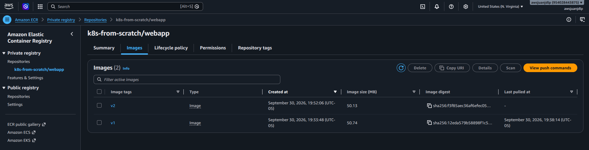

*Imagen 11. ECR con las dos versiones. `v1` muestra "Last pulled" (la descargó el
clúster) y `v2` todavía no se había usado.*

Rollout en el clúster:

```bash
REPO=954028443875.dkr.ecr.us-east-1.amazonaws.com/k8s-from-scratch/webapp
kubectl set image deployment/webapp-deployment app-container=$REPO:v2
kubectl annotate deployment webapp-deployment kubernetes.io/change-cause="imagen v2: python 3.12 + hostname"
kubectl rollout status deployment/webapp-deployment
kubectl get pods -o wide
kubectl get rs
kubectl rollout history deployment/webapp-deployment
```

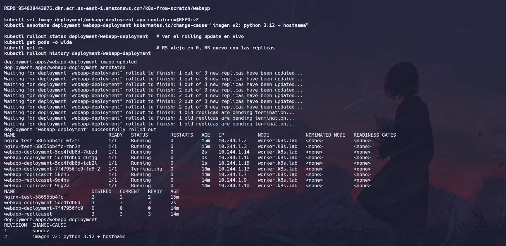

*Imagen 12. Rolling update de v1 a v2.*

**Interpretación:**

- **El rollout es gradual.** `rollout status` muestra `1 out of 3`, luego `2 out of 3`,
  luego `1 old replicas are pending termination` y por último `successfully rolled out`.
  Con 3 réplicas y la estrategia por defecto (`maxSurge: 25%` → 1, `maxUnavailable: 25%`
  → 0), Kubernetes crea un pod v2 y espera a que esté listo antes de terminar un v1. **En
  ningún momento hay menos de 3 pods disponibles: no se corta el servicio.**
- **Se crea un ReplicaSet nuevo.** `kubectl get rs` muestra `webapp-deployment-5dc4fdb6d`
  (v2) con `3/3/3`, y el anterior `webapp-deployment-7f47956fc9` (v1) en `0/0/0`. El
  viejo se conserva para hacer rollback (`kubectl rollout undo`).
- **Queda el historial.** `rollout history` muestra la revisión 1 (v1) y la revisión 2
  con su *change-cause*.
- En `get pods` se ve el último pod v1 (`fd8j2`) en `Terminating` mientras los 3 pods v2
  (`7kbzd`, `c6fjg`, `tcb2l`) ya están `Running`.

Verificación desde el Service:

```bash
for i in $(seq 1 10); do curl -s http://worker.k8s.lab:30001; echo; done
```

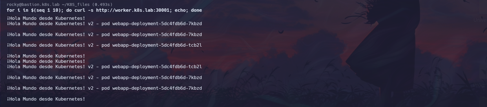

*Imagen 13. 6 respuestas vienen de pods v2 del Deployment (`7kbzd`, `tcb2l`) y 4 con el
mensaje de v1, que vienen de los pods del ReplicaSet suelto, que **no se actualizaron**.*

Esa mezcla es el resultado esperado y se analiza en la [sección 12.1](#121-replicaset-suelto-y-deployment-con-el-mismo-label).
El YAML `webapp-deployment.yaml` se actualizó a `:v2` para que el repositorio coincida con
el estado del clúster (`kubectl set image` es imperativo).

### 11.2 Implementar variables de entorno

El ConfigMap y el Secret del repositorio original **no los usaba ningún pod**. Se
conectaron al Deployment con `envFrom`, que convierte cada clave en una variable de
entorno:

```yaml
envFrom:
- configMapRef:
    name: webapp-configmap   # APP_ENV
- secretRef:
    name: db-secrets         # db_username, db_userpassword
```

```bash
kubectl exec deploy/webapp-deployment -- env | grep -E 'APP_ENV|db_'
```

En la Imagen 10 (sección 8), el contenedor tiene `APP_ENV=production` (del ConfigMap) y
`db_username=webapp` y `db_userpassword=cambiar-esta-clave` (del Secret). La Imagen 8
muestra la misma configuración desde `kubectl describe pod` (`Environment Variables from`).

> Un Secret **no está cifrado**, solo codificado en base64. Cualquiera con permiso de
> lectura sobre Secrets o con `exec` en el pod puede verlo, como muestra la captura. Los
> valores de este repositorio son de ejemplo. En producción se usaría RBAC restrictivo,
> cifrado de etcd en reposo o un gestor externo (AWS Secrets Manager con External
> Secrets).

### 11.3 Service tipo NodePort

**Este reto ya viene cumplido por el repositorio original.** `webapp-service.yaml` define
un Service `type: NodePort` con `nodePort: 30001`, y es el que se usó en todo el taller.
La evidencia es la de la [Fase 4](#8-fase-4-exposición-de-la-aplicación):

- Imagen 10: `webapp-service   NodePort   10.110.108.119   80:30001/TCP`
- Imagen 9a: `Type: NodePort`, `NodePort: 30001/TCP`
- Imágenes 7 y 13: la aplicación responde en `http://worker.k8s.lab:30001`

**Cómo funciona un NodePort:**

```text
cliente ──► worker.k8s.lab:30001 (NodePort, abierto en todos los nodos)
                 │  kube-proxy (iptables)
                 ▼
          10.110.108.119:80 (ClusterIP)
                 │  balanceo entre endpoints
                 ▼
          pod 10.244.1.x:5000 (targetPort, Flask)
```

| Tipo de Service | Alcance | Uso |
| --- | --- | --- |
| `ClusterIP` (por defecto) | Solo dentro del clúster | Comunicación entre microservicios |
| `NodePort` | `IP-del-nodo:30000-32767` | Exponer sin balanceador externo (labs, on-premise) |
| `LoadBalancer` | IP pública de un balanceador | Requiere un cloud controller (no está instalado en este clúster kubeadm) |

El puerto `30001` está fijado en el YAML. Si se omite `nodePort`, Kubernetes asigna uno
libre del rango 30000-32767 y así se evitan colisiones. Para que el NodePort sea
alcanzable, el clúster abre el rango `30000-32767/tcp` en el security group del worker y
en firewalld (configurado en el taller 1).

### 11.4 Analizar logs

```bash
kubectl logs deploy/webapp-deployment
```

En la Imagen 10 (sección 8) se ve el arranque de Flask:

- `Running on http://10.244.1.8:5000`: el contenedor escucha en la IP del pod (red
  Flannel `10.244.0.0/16`) en el puerto 5000, que es el `targetPort` del Service.
- `WARNING: This is a development server`: `app.py` usa el servidor de desarrollo de
  Flask con `debug=True`. **No es apto para producción**: es de un solo proceso y el
  *debugger* interactivo (`Debugger PIN`) permite ejecutar código si queda expuesto. Lo
  correcto sería servir la app con Gunicorn y `debug=False`.
- `Found 6 pods, using pod/webapp-deployment-7f47956fc9-dtbhr`: `kubectl logs deploy/...`
  elige **un** pod. Encontró 6 porque el selector `app=hola-mundo` del Deployment también
  coincide con los 3 pods del ReplicaSet suelto ([sección 12.1](#121-replicaset-suelto-y-deployment-con-el-mismo-label)).

---

## 12. Análisis técnico

### 12.1 ReplicaSet suelto y Deployment con el mismo label

El repositorio original define un ReplicaSet (3 réplicas) y un Deployment (2 réplicas)
con **el mismo label `app: hola-mundo`**. Se aplicaron ambos a propósito para observar el
efecto:

1. **No se pelean por los pods.** El ReplicaSet que crea el Deployment usa el selector
   `app=hola-mundo` + `pod-template-hash=7f47956fc9`, así que solo ve sus propios pods.
   Los pods del Deployment tienen `ownerReferences` hacia su ReplicaSet, y el ReplicaSet
   suelto no los adopta. Cada controlador mantiene su número: 3 + 2 = **5 pods**
   (Imagen 6), y después 3 + 3 = **6** tras escalar (Imagen 9b).
2. **El Service no distingue.** Su selector es solo `app=hola-mundo`, así que balancea
   entre los 5 o 6 pods sin importar quién los creó: los 5 endpoints de la Imagen 9a.
3. **El ReplicaSet no se actualiza.** Al cambiar la imagen, el Deployment hizo un rolling
   update a v2, pero los 3 pods del ReplicaSet siguieron en v1. Resultado: el **40 % de
   las respuestas** de la Imagen 13 (4 de 10) vino de la versión vieja. Un ReplicaSet solo
   garantiza *cuántos* pods hay, no *qué versión* tienen. Aunque se edite su template,
   no reemplaza los pods existentes.
4. **Herramientas que filtran por label también se confunden.** `kubectl logs deploy/...`
   reportó `Found 6 pods` (Imagen 10).

**Conclusión:** en la práctica no se crean ReplicaSets a mano. Se usa un Deployment, que
los crea y versiona, y se usan labels únicos por aplicación. Este experimento es la
evidencia concreta de la respuesta a la [pregunta obligatoria](#62-pregunta-obligatoria).

### 12.2 Cómo descarga el clúster imágenes privadas

| Opción | Cómo funciona | Por qué sí / no |
| --- | --- | --- |
| **Rol IAM del nodo + `ecr-credential-provider`** (elegida) | El kubelet ejecuta el plugin bajo demanda, y el plugin pide el token con el rol del nodo | Sin secrets ni rotación manual. Es lo que hace EKS. |
| `imagePullSecrets` (`regcred` del repo original) | Secret `dockerconfigjson` en cada namespace | El token de ECR vence a las 12 h y requiere un CronJob o controlador para renovarlo. |
| IRSA | Credenciales IAM para el proceso **dentro** del pod | No aplica a la descarga: la descarga la hace el kubelet antes de que exista el pod. |

**Seguridad:** el rol del nodo es `PullOnly`, así que no permite subir ni borrar
imágenes. Las instancias exigen IMDSv2 con límite de saltos 1, así que los pods (un salto
más lejos por la red de Flannel) no pueden leer las credenciales del nodo desde
`169.254.169.254`. Solo el kubelet y el plugin, que corren en el host, llegan.

### 12.3 Requests, limits y QoS

El Deployment declara `requests: cpu 50m, memory 64Mi` y `limits: memory 128Mi`
(Imagen 8):

- El **scheduler** usa los `requests` para decidir en qué nodo cabe el pod.
- El `limit` de memoria es un tope duro: si el contenedor lo supera, el kernel lo mata
  (`OOMKilled`) y el kubelet lo reinicia.
- Como `requests ≠ limits`, la clase de QoS es **Burstable**. Ante presión de memoria en
  el nodo, estos pods se desalojan antes que los `Guaranteed`.

---

## 13. Resumen de comandos

```bash
# --- Máquina local ---
git tag -a taller-1-cluster -m "Taller 1: clúster kubeadm en AWS con Terraform + Ansible"
git push origin taller-1-cluster

make up                           # infraestructura (Terraform) + clúster (Ansible) + ECR
make image                        # build + push de webapp:v1 a ECR
scp -r taller-2-apps/K8S-apps/K8S_files bastion:

# --- Bastión ---
kubectl get nodes                                         # Fase 1
cd K8S_files && kubectl apply -f .                        # Fase 3
kubectl get pods -o wide
kubectl get deployments
kubectl get services
kubectl describe pod <pod-del-deployment>                 # pull desde ECR
kubectl describe svc webapp-service                       # Fase 4
curl http://worker.k8s.lab:30001
kubectl scale deployment webapp-deployment --replicas=3   # Fase 5
kubectl get pods
kubectl delete pod <pod-del-deployment>                   # Fase 6
kubectl get pods
kubectl exec deploy/webapp-deployment -- env | grep -E 'APP_ENV|db_'   # Reto env
kubectl logs deploy/webapp-deployment                                  # Reto logs

# --- Reto: cambiar imagen ---
make image TAG=v2                                         # (máquina local)
kubectl set image deployment/webapp-deployment app-container=$REPO:v2
kubectl annotate deployment webapp-deployment kubernetes.io/change-cause="imagen v2: python 3.12 + hostname"
kubectl rollout status deployment/webapp-deployment
kubectl get rs
kubectl rollout history deployment/webapp-deployment
for i in $(seq 1 10); do curl -s http://worker.k8s.lab:30001; echo; done
kubectl rollout undo deployment/webapp-deployment         # rollback (opcional)

# --- Limpieza ---
make down                                                 # destruye todo, incluido el ECR
```

---

## 14. Conclusiones

1. **Kubernetes es declarativo.** Nunca se le ordenó "crea un pod" después de borrar
   uno: se declaró un estado deseado (3 réplicas, imagen v2), y los controladores del
   `kube-controller-manager` reconciliaron el estado real en segundos (Fases 5 y 6, reto
   11.1).
2. **El Deployment es la unidad correcta para aplicaciones sin estado.** Aporta
   self-healing y escalamiento, igual que un ReplicaSet, y además rolling updates sin
   corte e historial con rollback. El experimento del ReplicaSet suelto lo mostró en la
   práctica: 4 de cada 10 peticiones seguían llegando a la versión vieja.
3. **Los Services desacoplan la red de los pods.** Los pods cambian de nombre e IP con
   cada recreación o actualización, pero la ClusterIP y el NodePort `30001` se
   mantuvieron estables durante todo el taller.
4. **En un clúster propio (kubeadm), el operador resuelve lo que un servicio gestionado
   da hecho.** Aquí eso incluyó la autenticación contra el registro privado, que se
   resolvió en el kubelet con un credential provider y permisos IAM mínimos, sin
   credenciales guardadas en el clúster.
5. **Hay que diferenciar los cambios imperativos de los declarativos.** `kubectl scale` y
   `kubectl set image` sirven para operar, pero si el YAML no se actualiza, el próximo
   `kubectl apply` revierte el cambio. Por eso el YAML del Deployment se actualizó a v2.
